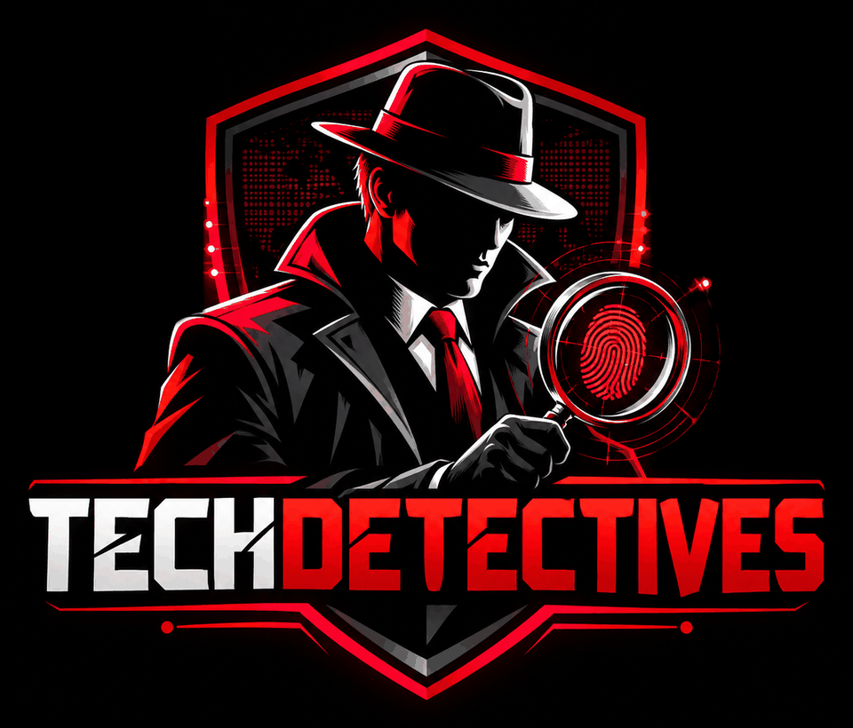

<p align="center"></p>

# TechDetechtives

A detection and threat-hunting platform: network and host monitoring, alerting, hunting and case management, with a notebook and Spark workbench for deeper analysis.

TechDetechtives is a **modified deployment built on Security Onion**, combined with an analytics workbench **derived from HELK**. It is an independent project, not affiliated with or endorsed by Security Onion Solutions, LLC or the HELK authors. See [NOTICE.md](NOTICE.md) and [MODIFICATIONS.md](MODIFICATIONS.md).

## What is in this repository

| Layer | Folder | What it does | Built on | Licence |
| --- | --- | --- | --- | --- |
| Platform overlay | `platform/` | Branded console pages and the TechDetechtives rule set, applied to an installed Security Onion | Security Onion 3.3.0 (not copied here) | Overlay files: MIT. Security Onion itself: Elastic License 2.0 |
| Analytics workbench | `analytics/` | Jupyter and Spark container, hunting notebooks, `td_hunt` helper library | HELK (modified) | GPL-3.0 |
| Ticketing | `ticketing/` | Opens a DFIR-IRIS ticket for every platform alert; installs DFIR-IRIS on your own host | DFIR-IRIS 2.4.29 (fetched at install, not copied here) | Forwarder: MIT. DFIR-IRIS itself: LGPL-3.0 |
| Vulnerability scanning | `vulnerability/` | Installs Greenbone (OpenVAS) on your own host; vulnerability dashboard, reports pages, findings into the platform, tickets for findings | Greenbone Community Edition (fetched at install, not copied here) | Connector: MIT. Greenbone itself: AGPL-3.0 and GPL-2.0 |
| Scripts and docs | `scripts/`, `docs/` | Install, verify, fetch upstream | Original | MIT |

Security Onion's code and image are **not** in this repository. You install Security Onion from its official ISO or installer, and this repository customizes that installation through the customization points Security Onion provides. That keeps upgrades working and keeps the two licences separate. [docs/ARCHITECTURE.md](docs/ARCHITECTURE.md) explains the design.

## Requirements

- **Platform host(s):** a working Security Onion 3.x installation (see its hardware requirements). The overlay runs on the manager node.
- **Analytics host:** a separate Linux host or VM with Docker and the Compose plugin, 4 CPU cores and 8 GB RAM as a starting point (allow about 4 GB more if it also runs ticketing), and network access to the manager on port 9200. It needs internet access once, at install, to download container images.

## Install

### 1. Platform (on the Security Onion manager)

```bash
git clone https://github.com/techdetechtives/techdetechtives.git techdetechtives && cd techdetechtives
sudo scripts/install.sh platform --dry-run        # show what would change
sudo scripts/install.sh platform --jupyter-url https://ANALYTICS-HOST:8888
sudo scripts/verify.sh platform
```

This installs the login banner and overview page, and commits the TechDetechtives Sigma, Suricata and YARA rules to the platform's local rule repositories. The previous pages are backed up, and `sudo platform/apply-overlay.sh revert` undoes everything.

### 2. Read-only access for the workbench (on the manager)

```bash
sudo platform/create-readonly-key.sh --allow-ip <analytics host IP>
```

It prints two lines for the config file and the command to copy the CA certificate.

### 3. Analytics workbench (on the analytics host)

```bash
git clone https://github.com/techdetechtives/techdetechtives.git techdetechtives && cd techdetechtives
cp config/techdetechtives.env.example config/techdetechtives.env
# paste TD_ES_HOST and TD_ES_API_KEY from step 2, and copy the CA certificate
# to analytics/certs/so-ca.crt
scripts/install.sh analytics
scripts/verify.sh analytics
```

Jupyter listens on `127.0.0.1:8888` only. Reach it with an SSH tunnel (`ssh -L 8888:127.0.0.1:8888 analytics-host`) and sign in with the `TD_JUPYTER_TOKEN` value from the config file.

### 4. Ticketing (on the analytics host)

```bash
scripts/install.sh ticketing --name <name analysts will use> --ip <this host's internal IP>
scripts/verify.sh ticketing
```

This installs DFIR-IRIS on this host with its own generated passwords and TLS certificate, then starts a forwarder that opens one DFIR-IRIS alert for every platform alert at medium severity or above. Everything stays on your internal network. See [ticketing/README.md](ticketing/README.md) for settings, sign-in and hardening.

### 5. Vulnerability scanning (on the ticketing machine)

```bash
scripts/install.sh vulnerability --name <name analysts will use> --ip <this host's internal IP>
scripts/verify.sh vulnerability
```

This installs Greenbone Community Edition (OpenVAS) on this host and starts the TechDetechtives vulnerability dashboard and reports pages. Findings can also be sent into the platform and opened as DFIR-IRIS tickets. See [vulnerability/README.md](vulnerability/README.md).

**Try it without a platform:** leave `TD_ES_HOST` empty and run step 3 alone. The notebooks then run on bundled synthetic sample data.

## Notebooks

| Notebook | What it shows |
| --- | --- |
| `01_connect_and_explore` | Connection check, available data sets, first Spark SQL query, regular-interval connections |
| `02_process_creation_hunt` | Rare parent-child pairs, long command lines, decoding encoded PowerShell |
| `03_logon_to_process_sql_join` | Spark SQL join of network logons to the processes they started |
| `04_process_tree_graph` | Process ancestry graph and the tree under a suspicious process |

Field names follow ECS, as on the platform. [docs/FIELD-MAPPING.md](docs/FIELD-MAPPING.md) maps HELK's field names to them.

## Customizing further

- **Console pages:** edit `platform/branding/banner.md` and `motd.md`, then re-run the platform step.
- **Logo, brand image, name and colours:** see [branding/README.md](branding/README.md).
- **Which engine for what:** Sigma rules match ingested logs. Suricata rules match network traffic. YARA rules match files extracted from traffic, not logs. Rules installed by the overlay arrive disabled; enable them under Detections.
- **Detections:** add Sigma rules to `platform/detections/sigma/`, Suricata rules to `suricata/` (SIDs 1900001 to 1900999 are reserved for this rule set), YARA rules to `yara/`, then re-run the platform step.
- **Notebooks:** add them under `analytics/notebooks/`. New notebooks in that folder are GPL-3.0 if they build on the existing ones.
- **Platform settings** (retention, sensors, integrations): use the console's Administration > Configuration screen. Those settings are stored by the platform and survive upgrades.

## Upgrading

Upgrade the platform with its own upgrade tool (`soup`). The overlay lives in the platform's local override folders and rule repositories, which upgrades keep. After a major-version upgrade, run `sudo scripts/verify.sh platform` and compare against the new upstream release with `scripts/fetch-upstream.sh`.

## Status

Version 0.4.1. What has and has not been exercised is listed in [MODIFICATIONS.md](MODIFICATIONS.md#test-status). In short: the overlay script, installers, notebook logic and static checks were tested against a mock platform tree and the sample data; the platform pages were confirmed on a live Security Onion 2.4.211; the container image builds, Spark, and live DFIR-IRIS and Greenbone runs have not been tested yet.

## Licence

See [NOTICE.md](NOTICE.md). Two limits come from the Elastic License 2.0 and apply to anyone running this: the platform may not be offered to third parties as a hosted or managed service, and its licence-key features may not be altered or bypassed.
